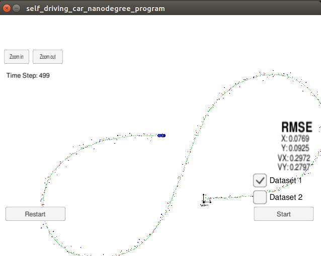
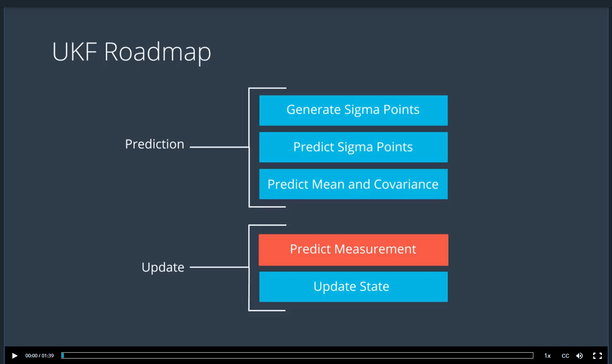

# Extended Kalman Filter Project Starter Code
Self-Driving Car Engineer Nanodegree Program

In this project I will utilize a kalman filter to estimate the state of a moving object of interest with noisy lidar and radar measurements. 

The goals / steps of this project are the following:

* 1.Your code should compile.
* 2.px, py, vx, vy output coordinates must have an RMSE <= [.09, .10, .40, .30] when using the file: "obj_pose-laser-radar-synthetic-input.txt", which is the same data file the simulator uses for Dataset 1.
* 3.Your Sensor Fusion algorithm follows the general processing flow as taught in the preceding lessons.
* 4.Your Kalman Filter algorithm handles the first measurements appropriately.
* 5.Your Kalman Filter algorithm first predicts then updates.
* 6.Your Kalman Filter can handle radar and lidar measurements.
* 7.Your algorithm should avoid unnecessary calculations.


### [Rubric](https://review.udacity.com/#!/rubrics/783/view) Points
### Here I will consider the rubric points individually and describe how I addressed each point in my implementation.  

#### 1.Your code should compile.
I compile project by following instructions:

1. mkdir build
2. cd build
3. cmake ..
4. make
5. ./UnscentedKF

#### 2.px, py, vx, vy output coordinates must have an RMSE <= [.09, .10, .40, .30] when using the file: "obj_pose-laser-radar-synthetic-input.txt", which is the same data file the simulator uses for Dataset 1.
My RMSE is [0.0769, 0.0925, 0.2972, 0.2797], here is a screenshot:
<div class="test">

</div>


#### 3.Your Sensor Fusion algorithm follows the general processing flow as taught in the preceding lessons.
Here is a screenshot in the lesson that I followed by :
<div class="test">

</div>

#### 4.Your Kalman Filter algorithm handles the first measurements appropriately.
By the first measurements, I initialized some variables:
x_
P_
R_laser_
R_radar_
n_x_
n_aug_
lambda_

  
#### 5.Your Kalman Filter algorithm first predicts then updates.
Here is a code fragment about predicts and Updates:
```

  Prediction(delta_t);

  if (meas_package.sensor_type_ == MeasurementPackage::RADAR) {

     UpdateRadar(meas_package);

  }
  else if (meas_package.sensor_type_ == MeasurementPackage::LASER) {

     UpdateLidar(meas_package);

  }

```

#### 6.Your Kalman Filter can handle radar and lidar measurements.
convert the Radar data to the new model:
```
...
      float ro = meas_package.raw_measurements_(0);
      float theta = PI/ 2 - meas_package.raw_measurements_(1);

      float px = ro * cos(theta);
      float py = ro * sin(theta);

      x_(0) = ro * cos(theta);
      x_(1) = ro * sin(theta);
      x_(2) = 0;
      x_(3) = atan2(py, px);
      x_(4) = 0;
...

    float ro = meas_package.raw_measurements_(0);
    float theta = PI/2 - meas_package.raw_measurements_(1);

    float px = ro * cos(theta);
    float py = ro * sin(theta);
    float vx = (px - x_(0));
    float vy = (py - x_(1));

    //x_(0) = px;
    //x_(1) = py;
    x_(2) = sqrt(vx * vx + vy * vy);
    x_(4) = (theta - x_(3)) / delta_t;
    x_(3) = theta;

...

```
convert the Lidar data to the new model:
```
...
      float px = meas_package.raw_measurements_(0);
      float py = meas_package.raw_measurements_(1);

      x_(0) = px;
      x_(1) = py;
      x_(2) = 0;
      x_(3) = atan2(py, px);
      x_(4) = 0;
...

    float px = meas_package.raw_measurements_(0);
    float py = meas_package.raw_measurements_(1);
    float vx = (px - x_(0)) / delta_t;
    float vy = (py - x_(1)) / delta_t;

    //x_(0) = px;
    //x_(1) = py;
    x_(2) = sqrt(vx * vx + vy * vy);
    x_(4) = (atan2(vy, vx) - x_(3)) / delta_t;
    x_(3) = atan2(vy, vx);

...


```


#### 7.Your algorithm should avoid unnecessary calculations.
I declare some variables (like R_laser_ , R_radar_ , lambda_ etc.)  avoid loop calculations.

